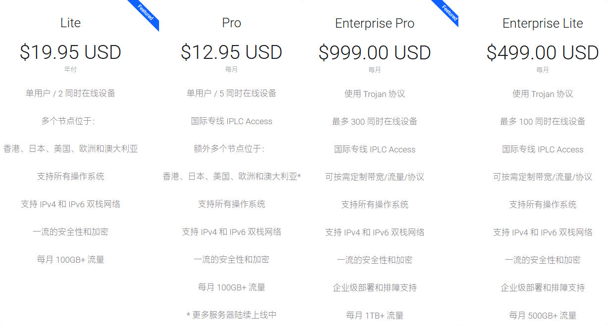

# shadowsocks.com 2025年双十一促销

永久官网：[shadowsocks.com](https://secure.shadowsocks.au/aff.php?aff=32113)

## shadowsocks.com怎么样？

shadowsocks.com 是一家老牌加速服务商，最早与 shadowsocks 开源项目合作，采用 Shadowsocks 协议，后来改用 Trojan 协议，全直连节点，公司最新的国内可访问域名是[shadowsocks.au](https://secure.shadowsocks.au/aff.php?aff=32113)。

支持 Shadowrocket、Trojan、Clash、Surge、Quantumult X 等订阅链接，也支持单个节点扫描二维码导入，并且支持手动复制单个节点的 Trojan 配置文件和链接。

Shadowsocks.com 致力于隐私保护和推行真实互联网已长达十二年时间。

## shadowsocks.com优惠码？

在双十一活动期间，访问[活动页面](https://secure.shadowsocks.au/aff.php?aff=32113)续费或新购服务时，将享受30%-40%折扣优惠价格。

> 新购或续费1年服务享受7折优惠，2年服务享受65折，3年服务则享有6折优惠，适用于Lite和Pro服务。

如果支付宝 Omipay 无法支付，可以选择使用 “支付宝 / 微信支付 / MET”

流量重置会在每月 1 号北京时间上午 9 点左右完成

## shadowsocks.com套餐价格

节点地区：

香港、日本、台湾、美国、澳大利亚、德国、爱沙尼亚、荷兰、英国

shadowsocks.com 套餐价格以美元计费，低至$19.95美元年付。除了个人套餐之外，也有针对企业用户的套餐，Enterprise 套餐支持定制，甚至有 IPLC 线路可用。

